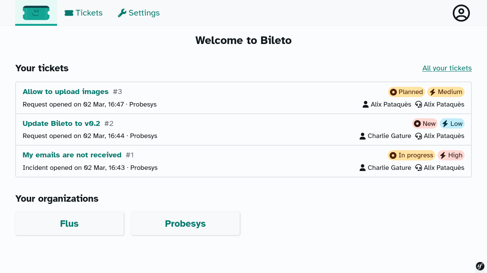

<h1 align="center">Bileto</h1>

    <strong>The ergonomic ticketing tool for managing your Help Desk.</strong> 
    <a href="https://bileto.fr">bileto.fr</a>

---

Bileto is a ticketing tool.
It is designed to help you to manage your support as efficiently as possible.
It allows you:

- to manage your tickets (create, answer, manage their lifecycle) in a modern way (clear timeline, efficient lists);
- to isolate your users and tickets in organizations;
- to finely manage roles and permissions;
- and a lot more to come: [see our roadmap to learn more.](/ROADMAP.md)

**Please note that Bileto is in an active development phase.**
Things may break between releases and it is not advised to use Bileto in production yet.

It is written with [Symfony](https://symfony.com/) 6.2 and works with [PHP](https://www.php.net/) 8.1.
The supported databases are PostgreSQL 14 and MariaDB 10.6.

It is developed by [Probesys](https://probesys.com) as a community project.

Bileto is licensed under [GNU Affero General Public License v3.0 or later](LICENSE.txt).

    

## Contributing

Ideas, bug reports and contributions are welcome. Please follow [the contributing guide](CONTRIBUTING.md).

## Documentation

Administrators guide:

- [Deploy in production](/docs/administrators/deploy.md)
- [Changelog of Bileto](/CHANGELOG.md)

Developers guide:

- [Setup the development environment](/docs/developers/setup.md)
- [Update the development environment](/docs/developers/update.md)
- [Executing tests and linters](/docs/developers/tests.md)
- [Managing the dependencies](/docs/developers/dependencies.md)
- [Using the translations](/docs/developers/translations.md)
- [Working with the roles & permissions](/docs/developers/roles.md)
- [Declaring a new Entity](/docs/developers/entity.md)
- Frontend:
    - [Working with the icons](/docs/developers/icons.md)
    - [Working with the modals](/docs/developers/modals.md)
    - [Working with the popups](/docs/developers/popups.md)
    - [Working with the notifications](/docs/developers/notifications.md)
    - [Working with rows and grids](/docs/developers/rows-and-grids.md)

Maintainers guide:

- [How to release a version](/docs/maintainers/release.md)

## Credits

Bileto relies on a bunch of other projects:

- [Atkinson Hyperlegible Font](https://brailleinstitute.org/freefont)
- [ESLint](https://eslint.org/)
- [Font Awesome icons](https://fontawesome.com)
- [PHP\_CodeSniffer](https://github.com/squizlabs/PHP_CodeSniffer)
- [PHPUnit](https://phpunit.de/)
- [Radix UI Colors](https://www.radix-ui.com/colors)
- [Stimulus](https://stimulus.hotwired.dev/)
- [Stylelint](https://stylelint.io/)
- [Symfony](https://symfony.com/)
- [TinyMCE](https://www.tiny.cloud/tinymce/)
- [Turbo](https://turbo.hotwired.dev/)
- [Vite](https://vitejs.dev/)

Thanks to their authors!
