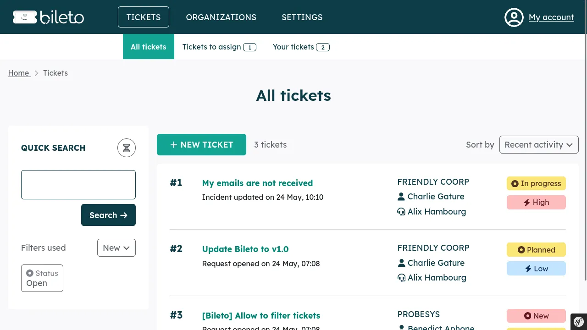

<h1 align="center">Bileto</h1>

    <strong>The ergonomic ticketing tool for managing your Help Desk.</strong> 
    <a href="https://bileto.fr">bileto.fr</a>

---

Bileto is a ticketing tool.
It is designed to help you to manage your support as efficiently as possible.
It allows you to:

- manage your tickets (create, answer, manage their lifecycle) in a modern way (clear timeline, efficient lists);
- attach files to your messages;
- isolate your users and tickets in organizations;
- finely manage roles and permissions;
- create and answer to tickets by emails;
- login with LDAP;
- and a lot more to come: [see our roadmap to learn more.](/ROADMAP.md)

**Please note that Bileto is in an active development phase.**
It is not advised to use Bileto in production yet.

It is written with [Symfony](https://symfony.com/) 6.3 and works with [PHP](https://www.php.net/) 8.1 or 8.2.
The supported databases are PostgreSQL >= 11 and MariaDB >= 10.4.

It is developed by [Probesys](https://probesys.com) as a community project.

Bileto is licensed under [GNU Affero General Public License v3.0 or later](LICENSE.txt).

    

## Contributing

Ideas, bug reports and contributions are welcome. Please follow [the contributing guide](CONTRIBUTING.md).

## Documentation

- [The Administrators' Guide](/docs/administrators/README.md)
- [The Developers' Guide](/docs/developers/README.md)

## Credits

Bileto relies on a bunch of other projects:

- [Atkinson Hyperlegible Font](https://brailleinstitute.org/freefont)
- [ESLint](https://eslint.org/)
- [Font Awesome icons](https://fontawesome.com)
- [PHP\_CodeSniffer](https://github.com/squizlabs/PHP_CodeSniffer)
- [PHP-IMAP](https://www.php-imap.com/)
- [PHPUnit](https://phpunit.de/)
- [Radix UI Colors](https://www.radix-ui.com/colors)
- [Stimulus](https://stimulus.hotwired.dev/)
- [Stylelint](https://stylelint.io/)
- [Symfony](https://symfony.com/)
- [TinyMCE](https://www.tiny.cloud/tinymce/)
- [Turbo](https://turbo.hotwired.dev/)
- [Vite](https://vitejs.dev/)

Thanks to their authors!
